# Food Supplier Campaign Market Analytics

## Overview

This Project aims to enhance campaign performance and sales for Global Food Supply, a leading food delivery company operating in over 8 countries. This end-to-end analysis involves a detailed exploration of marketing data from six sales-boosting campaigns, focusing on customer responses and spending patterns.

## Company Overview

- **Name:** Global Food Supply
- **Industry:** Food Delivery
- **Presence:** Operating in over 8 countries
- **Customer Base:** Serving nearly one million consumers annually

## Strategic Objective

The primary goal of this project is to analyze marketing data and propose data-driven solutions to improve campaign performance and boost sales.

## Dataset Overview

The dataset captures details from six marketing campaigns, including customer IDs, annual income, family specifics, and education qualifications. The analysis involves understanding customer spending on specific categories like wine and meat products.


1. **Data Cleaning & Preprocessing:**

   - Handling Missing Values - found 26 missing values in Income {Dropped columns with missing values}
   - Basic cleaning techniques, formatting datatypes, and encoding categorical columns
   - Feature engineering for creating new features
   - Outliers treatment using box plots

   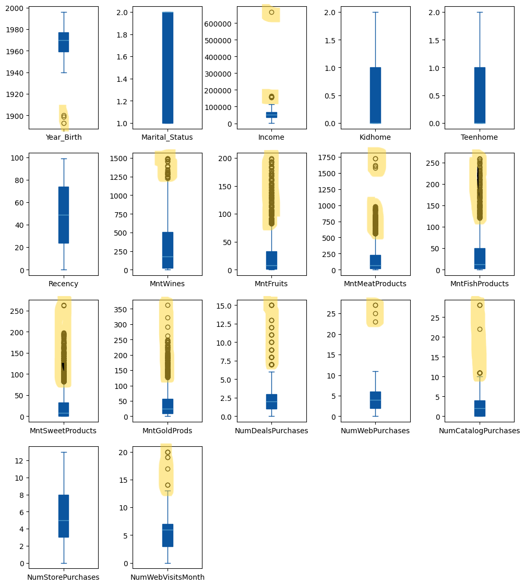
   
   ### Dealing with outliers
   ```python
   def outlier_removal(df, column):
    Q1 = df[column].quantile(0.25)
    Q3 = data[column].quantile(0.75)
    IQR = Q3 - Q1
    lower_bound = Q1 - 1.5 * IQR
    upper_bound = Q3 + 1.5 * IQR
    df = df[(df[column] > lower_bound) & (df[column] < upper_bound)]
    return df
   # Outlier removal for TotalMnt and Income Columns
   data = outlier_removal(data, 'TotalMnt')
   data = outlier_removal(data, 'Income')
   ```
   Box plot for Verification
   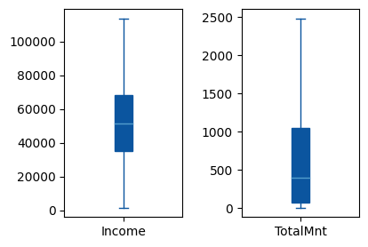

   ### Income Distribution (Histogram Plot)

   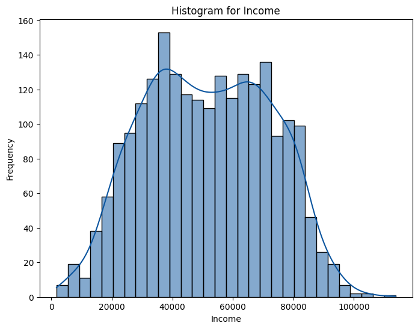

   Income distribution is close to normal distribution with no outliers.

   ## Correlation matrix
    - There are many columns in the data. The correlation matrix will be very crowded if we use all columns of the data frame. We will group the columns and explore correlation between columns in each group and the column 'TotalMnt'. We will focus on the column 'TotalMnt' to understand how we can segment the customers who buy the most in overall. We can run similar analysis for every type of product.

    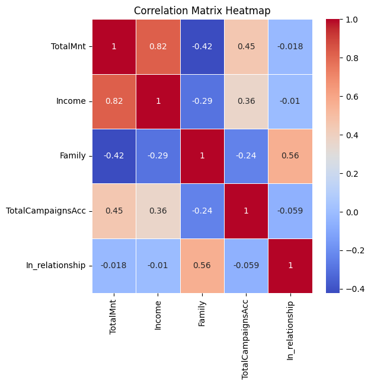

    ### Features Analysis
    - Income, TotalMnt, Total Campaign Acceptance

    

    - Family, TotalMnt, Total Campaign Acceptance

    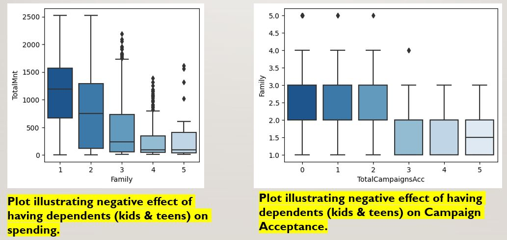
   
   ### Plots conclusion:
   - Increased income leads to increased spending, which leads to increased acceptance of advertising campaigns.
   - Negative effect of having Kids and Teens on Spending and Campaigns Acceptance 
         


  - Region Acceptance
    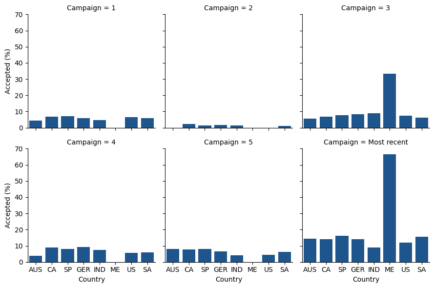
    - Mexico (ME) has Highest Acceptance in {Most recent} campaign = 66.66%

3. **Data Visualization:**
   - Visual tools like charts, graphs, and maps to reveal patterns and trends
   - Bar charts for region-wise acceptance rates, bar charts for campaign success rates by country
        - What is the best-selling product during marketing campaigns?
        

        - Which Country has highest amount spent? 
        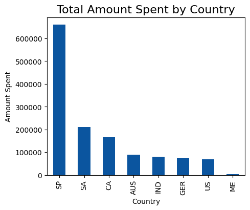

   - Region wise campaign acceptance
    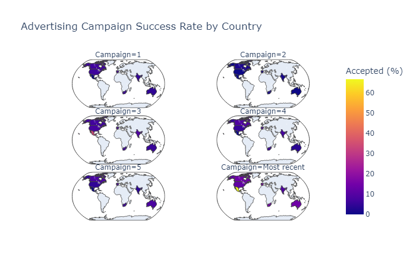

   - Which marketing campaign is most successful? 
    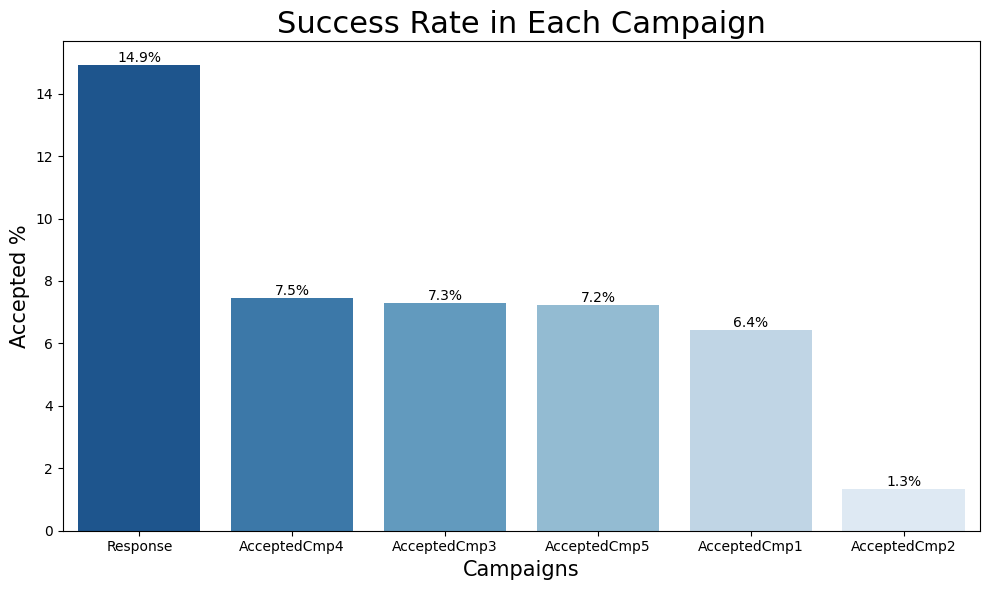


   - **Conclusion:** Mexico (ME) exhibits the highest acceptance rate in the most recent campaign, with 66.66%.


5. **K-Mean Clustering:** Based on the Market Analytics performed we have derived to cluster the customers into groups for promoting campaigns.
      
    ## Standardising data
    - K-means clustering algorithm is based on the calculation of distances between data points to form clusters. When features have different scales, features with larger scales can disproportionately influence the distance calculation. There are various ways to standardise features, we will use standard scaling .

    ## Principal Component Analysis (PCA)
    - PCA is a technique of dimensionality reduction. PCA takes the original features (dimensions) and create new features that capture the most variance of the data.    

    ```python
    from sklearn import decomposition
    pca = decomposition.PCA(n_components = 2)
    pca_res = pca.fit_transform(data_scaled[cols_for_clustering])
    data_scaled['pc1'] = pca_res[:,0]
    data_scaled['pc2'] = pca_res[:,1]
    ```
    ## Elbow method
    - The elbow method is a technique used to determine the optimal number of clusters (K) for K-means clustering algorithm.
    - Plot
    
    

    Elbow method suggests 4 or 5 clusters. Let's check silhouette score.

    ## Silhouette score analysis
    - Silhouette score is a metric that used to assess the quality of clustering. A higher silhouette score indicates that the clusters are well-separated, while a lower score suggests that the clusters may overlap or are poorly defined.

    ```python
    from sklearn.metrics import silhouette_score
    silhouette_list = []
    for K in range(2,10):
        model = KMeans(n_clusters = K, random_state=7)
        clusters = model.fit_predict(X)
        s_avg = silhouette_score(X, clusters)
        silhouette_list.append(s_avg)

    plt.figure(figsize=[7,5])
    plt.plot(range(2,10), silhouette_list, color=(54 / 255, 113 / 255, 130 / 255))
    plt.title("Silhouette Score vs. Number of Clusters")
    plt.xlabel("Number of Clusters (K)")
    plt.ylabel("Silhouette Score")
    plt.show()
    ```
    - Plot
    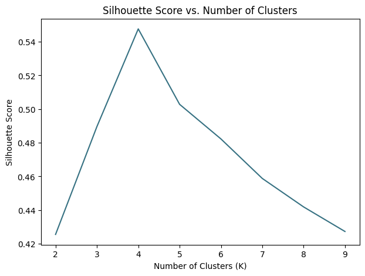 

    The highest silhouette score is for 4 clusters.


    ## Performing K-Mean Clustering:
    ```python
    from sklearn.cluster import KMeans
    model = KMeans(n_clusters=4, random_state = 7)
    model.fit(data_scaled[cols_for_clustering])
    data_scaled['Cluster'] = model.predict(data_scaled[cols_for_clustering])
    ```
    ### Exploration of Clusters
    - In this section:

        - Visualisation of clusters
        - Mean consumption of different product types by cluster
        - Cluster sizes
        - Income by cluster
        - In_relationship feature by cluster

    ### Visualisation of clusters

    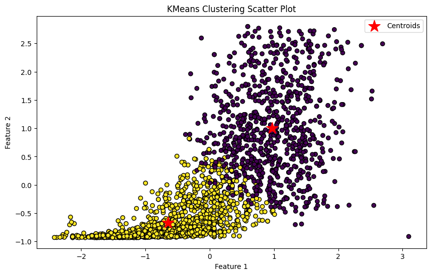

    ### Mean consumption of different product types by cluster

    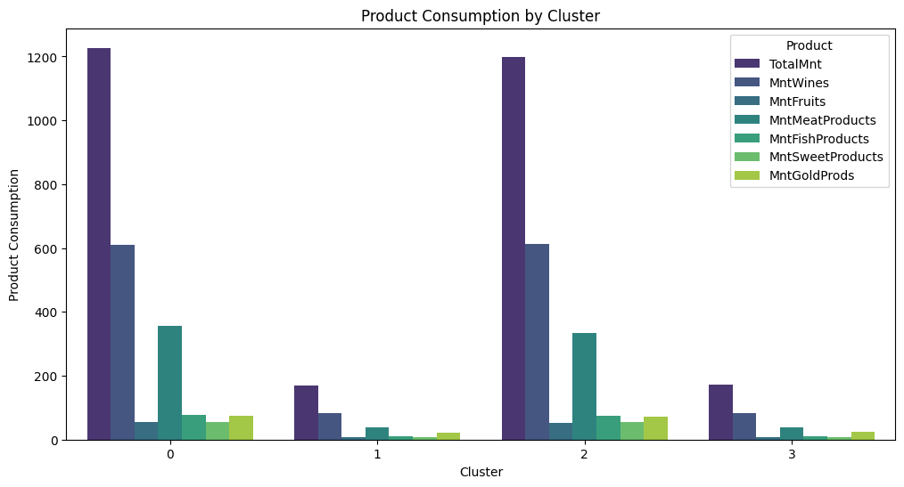

    ### Cluster Size

    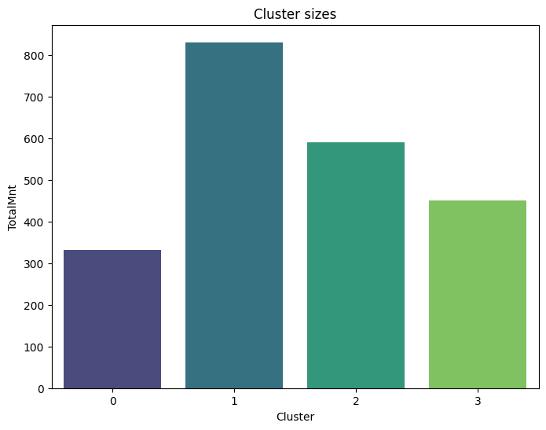

    ### Income By Cluster

    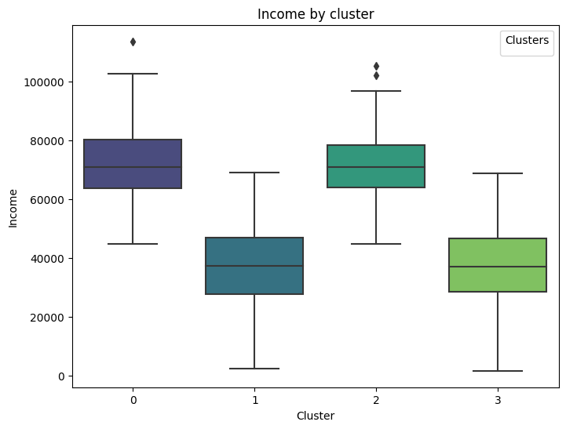

    ### Scatter Plot : Income & Total Amout Spent by Clusters

    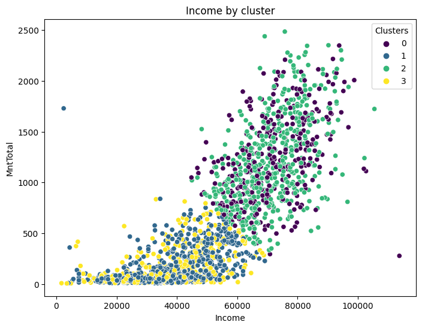

    ### In Relationship Feature by Cluster

    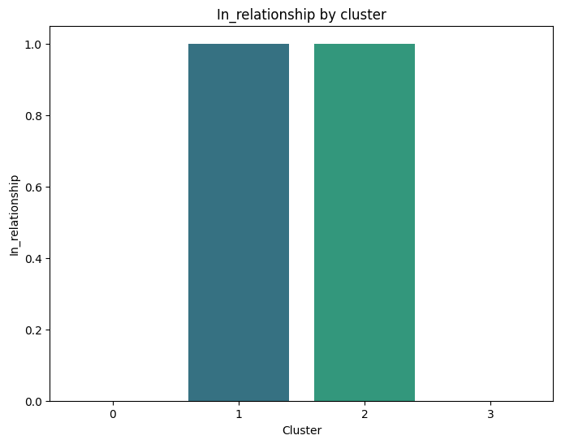

    


## Results
This section contains the results of the K-means clustering analysis, which aimed to identify distinct customer segments based on the total amount of purchases they made (MntTotal). The analysis utilised 'Income' and 'In_relationship' features.

### Optimal number of clusters = 4
The Elbow Method and Silhouette Analysis suggested 4 clusters (k=4). The elbow method highlighted the number of 4 or 5 clusters as a reasonable number of clusters. The silhouette score analysis revealed a peak silhouette score for k=4.

### Cluster Characteristics

Cluster 0: High value customers in relationship (either married or together)
- This cluster represents 26% of the customer base
- These customers have high income and they are in a relationship

Cluster 1: Low value single customers
- This cluster represents 21% of the customer base
- These customers have low income and they are single

Cluster 2: High value single customers
- This cluster represents 15% of the customer base
- These customers have high income and they are single

Cluster 3: Low value customers in relationship
- This cluster represents 39% of the customer base
-These customers have low income and they are in a relationship


## Recommendations
Based on the clusters, tailored marketing strategies can be created. Customers from these segments will have different interests and product preferences.

### Marketing Strategies for Each Cluster

Cluster 0: High value customers in relationship (either married or together)
- Preliminary analysis showed that high income customers buy more wines and fruits.
- A tailored campaign to promote high quality wines may bring good results.
- This cluster contains customers in relationship, family-oriented promo-images should be quite effective for this audience.

Cluster 1: Low value single customers
- Promos with discounts and coupons may bring good results for this targeted group.
- Loyalty program may stimulate these customers to purchase more often.

Cluster 2: High value single customers
- Similar to the Cluster 0, these customers buy a lot of wines and fruits.
- This cluster contains single customers. Promo images with friends, parties or single trips may be more efficient for single customers

Cluster 3: Low value customers in relationship
- This cluster has the highest percentage of our customers (39%).
- Family offers and discounts may influence these customers to make more purchases

### Opportunities for the further analysis
- Further exploration on how children influence on the consumed products
- Further analysis on the influence of education
- analysis of frequent buyers
- Analysis of sales channels, e.g. store, website, etc.
- Analysis of the response to the marketing campaigns
- It would be great to add gender data to the dataset
- Test different clustering algorithms

## Tools & Technologies Used

- **Programming Language:** Python
- **Working Environment:** Visual Studio Code, Python Environment (Python 3.x)
- **Libraries and Frameworks:** Pandas, Numpy, Seaborn, Matplotlib, Scikit-learn (Sklearn), Scipy

Thank you for exploring the Food Supplier Campaign Market Analytics project developed by Manoj Kumar Thota!
