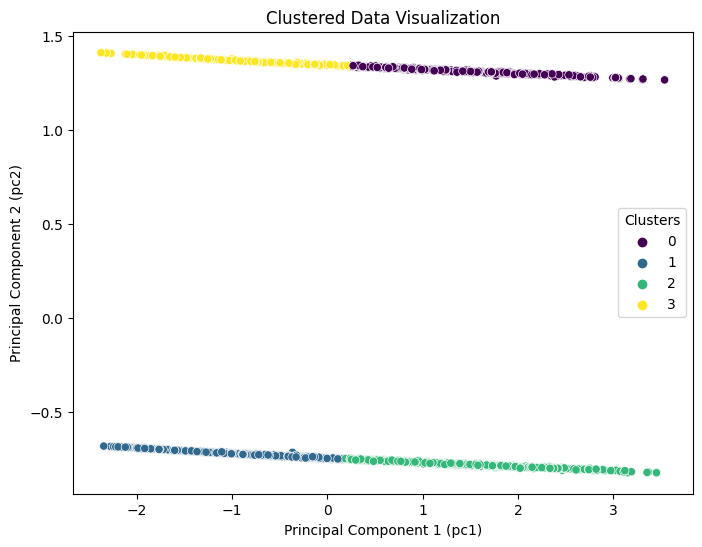

# Food Supplier Campaign Market Analytics

## Overview

This Project aims to enhance campaign performance and sales for Global Food Supply, a leading food delivery company operating in over 8 countries. This end-to-end analysis involves a detailed exploration of marketing data from six sales-boosting campaigns, focusing on customer responses and spending patterns.

## Company Overview

- **Name:** Global Food Supply
- **Industry:** Food Delivery
- **Presence:** Operating in over 8 countries
- **Customer Base:** Serving nearly one million consumers annually

## Strategic Objective

The primary goal of this project is to analyze marketing data and propose data-driven solutions to improve campaign performance and boost sales.

## Dataset Overview

The dataset captures details from six marketing campaigns, including customer IDs, annual income, family specifics, and education qualifications. The analysis involves understanding customer spending on specific categories like wine and meat products.

## Analysis Road Map

1. **Data Cleaning & Preprocessing:**

   - Handling missing values using K-Nearest Neighbors (KNN) Imputer

   ```python
    import pandas as pd
    from sklearn.impute import KNNImputer
    #missing value check
    print('Sum of missing values before imputing:',data.isnull().sum().sum())
    imputer = KNNImputer(n_neighbors=5)
    imputed_data = imputer.fit_transform(data[['Income']])
    Income_impute=pd.DataFrame(imputed_data,columns=['Income'])
    data['Income']=Income_impute['Income'].reset_index(drop=True)

    #missing value check
    print('Sum of missing values:',data.isnull().sum().sum())
   ```
   - Basic cleaning techniques, formatting datatypes, and encoding categorical columns
   - Feature engineering for creating new features
   - Outliers treatment using box plots

   
   
   - Dealing with Year_Birth outliers

   
   - **Conclusion:** Identified outliers in the 'Year_Birth' column were removed, enhancing data integrity.

2. **Exploratory Data Analysis (EDA):**
   - Univariate, Bivariate, and Multivariate analysis
   - Data visualization using histograms, pie charts, and correlation plots
        - Histogram for data distribution
        
        

        - Correlation Plot for understanding variables correlation
        
        

   - Interpretation of scatter plots and box plots to identify relationships
    
    

   - Education Analysis
    
    

   - Hypothesis Testing:
    - Shapiro-Wilk Test:
        
        - Based on the result we conclude that data is not normally distributed, we need to choose a non-parametric tests (Mann-Whitney U Test)
    
    - Hypothesis Testing: Mann-Whitney U Test 
        
        - The Mann-Whitney U test results indicate that the average income of PhD Customers is statistically different from that of Graduation Customers.
         
   - Feature Importance:
    - Random Forest Classifier for Feature Importance:
        ```python
            from sklearn.ensemble import RandomForestClassifier

        # Features 
        X =data.drop(['is_accepted','TotalCampaignsAcc','AcceptedCmp1', 'AcceptedCmp2'
                    , 'AcceptedCmp3', 'AcceptedCmp4', 'AcceptedCmp5', 'Response','Education', 'Country','Marital_Status','Kidhome','Teenhome' ],axis=1)
        y = data.TotalCampaignsAcc

        # Loading regression model
        clf_rf = RandomForestClassifier(random_state=43)      
        clr_rf = clf_rf.fit(X,y)

        # extracting feature importance
        importances = clr_rf.feature_importances_
        std = np.std([tree.feature_importances_ for tree in clr_rf.estimators_],axis=0)
        indices = np.argsort(importances)[::-1]

        # Plot the feature importances of the forest
        plt.figure(1, figsize=(14, 13))
        plt.title("Feature importances")
        plt.bar(range(X.shape[1]), importances[indices],color="g", yerr=std[indices], align="center")
        plt.xticks(range(X.shape[1]), X.columns[indices],rotation=90)
        plt.xlim([-1, X.shape[1]])
        plt.show()
        ```
    - plot
        
        - As we have seen, there is a strong relationship between acceptance of advertising campaigns and MntWines, income, & TotalMnt, MntGoldprods, MntMeatProducts.

  - Region Acceptance
    
    - Mexico (ME) has Highest Acceptance in {Most recent} campaign = 66.66%

3. **Data Visualization:**
   - Visual tools like charts, graphs, and maps to reveal patterns and trends
   - Bar charts for region-wise acceptance rates, bar charts for campaign success rates by country
        - What is the best-selling product during marketing campaigns?
        

        - Which Country has highest amount spent? 
        

   - Region wise campaign acceptance
    

   - Which marketing campaign is most successful? 
    


   - **Conclusion:** Mexico (ME) exhibits the highest acceptance rate in the most recent campaign, with 66.66%.

4. **Conclusion:** Identified campaign success, correlation insights, product focus, and targeted campaign approach.
        - Divide customers into groups based on income and tailor advertising campaigns accordingly.

5. **K-Mean Clustering:** Based on the Market Analytics performed we have derived to cluster the customers into groups for promoting campaigns.
        - Based on Feature Importance Plot we have derived "Income, MntWines, TotalMnt" are the top most features that shows effect on Total Campaigns Acceptance.
        
    ## Identifying Clusters Based on Elbow Method.
    
    

    ## Performing K-Mean Clustering:
    ```python
    from sklearn.cluster import KMeans
    kmeans = KMeans(n_clusters=2, random_state=42)
    customer_clusters = kmeans.fit_predict(X_scaled)
    ```
    ## Result Plot
    
    

    ## Evaluation Results:
       - Inertia: 2070.8665
       - Silhouette Score: 0.5829
6. **Clustering Conclusion** 
    - The K-Means clustering model with 2 clusters performs well based on both the Inertia and Silhouette Score.
    - The Inertia value suggests that the clusters are relatively compact.
    - The Silhouette Score indicates a good separation between the clusters.
 
## Areas for Improvement

- Perform analysis on customer purchasing platforms.
- Build a recommendation model using reinforcement learning for personalized campaigns.

## Tools & Technologies Used

- **Programming Language:** Python
- **Working Environment:** Visual Studio Code, Python Environment (Python 3.x)
- **Libraries and Frameworks:** Pandas, Numpy, Seaborn, Matplotlib, Scikit-learn (Sklearn), Scipy

## Conclusion

The Food Supplier Campaign Market Analytics project delivers crucial insights into customer behavior and campaign effectiveness. Through meticulous data cleaning, exploratory data analysis (EDA), and visualization, actionable recommendations have been identified for targeted campaign strategies, contributing to the overall success of the company. The successful clustering of customers into segments further enhances the potential for a refined and personalized campaign approach. By tailoring marketing efforts to the unique characteristics of each cluster, the company aims to elevate customer engagement, boost campaign acceptance rates, and ultimately drive increased sales. The robust evaluation metrics instill confidence in the effectiveness of the clustering strategy, laying a solid foundation for a successful and data-driven marketing approach.


Thank you for exploring the Food Supplier Campaign Market Analytics project developed by Manoj Kumar Thota!
